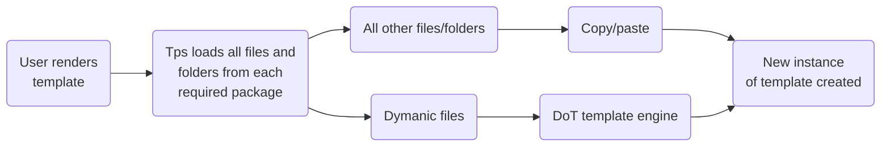

import { Example } from '@site/docs/components/example';
import { Dot } from '@site/docs/components/dot';
import Tabs from '@theme/Tabs';
import TabItem from '@theme/TabItem';

# Dynamic Files

## Dynamic files breakdown

### What is a dynamic file

Tps goes beyond simple copy and paste functionality; it enables the existence of
a more versatile and powerful system. When working with reusable concepts, the
ability to incorporate additional information becomes essential. This is where
dynamic files come into play.

Dynamic files reside within your template's package folders, much like any other
file. However, dynamic files undergo a different processing procedure. Tps reads
the contents of dynamic files, which are then processed by a templating language
called [doT](http://olado.github.io/doT/index.html).



### What is doT

DoT is based on JavaScript and uses `{{}}` brackets for interpolation. doT is a
templating language similar to popular options like Handlebars, EJS, or Jade. It
provides various types of interpolation, including loops, conditionals, and
more. You can use any valid JavaScript code inside these brackets.

To learn more about doT, you can visit its documentation. However, let's
introduce you to the basics here.

:::danger

It's important to consider that not all JavaScript features may be supported
across different computers or versions of Node when running these templates. As
a result, certain JavaScript functionality may not work as expected or behave
differently.

:::

## How to use doT

Like mentioned before doT uses `{{}}` brackets. Here are some common ways on how
you can use doT

:::caution

when it comes to creating complex templates, you may encounter a need to indent
the dot syntax to improve readability. However, be aware that this can cause
unexpected issues with the appearance of the rendered template. While the
indented structure may look good in the template itself, when the dot processes
these files, it doesn't recognize or handle the indentation properly. This has
been my experience with using it, and you can find more detailed information
about this issue in the following link:
https://github.com/marcellino-ornelas/templates/issues/7

:::

### Evaluation

In doT, evaluation is achieved using `{{ <expression>}}`. The expression can be
any valid JavaScript code, enabling the creation of variables, functions, and
various other possibilities. **The semi-colon at the end of the expression is
mandatory!**

<Tabs>

<TabItem value="inline" label="Inline">

<Dot>

```text
{{const name = "Marcellino Ornelas";}}
```

</Dot>

One limitation of evaluations are that it leaves a empty space where it was
placed at. We recommend avoid using as much as possible but could be useful in
some cases

<Example title="Evaluations leaves new line">

<Dot>

```text
// highlight-next-line
{{const name = "john doe";}}
hey
```

</Dot>

</Example>

</TabItem>

<TabItem value="block" label="Block">

</TabItem>

</Tabs>

### Interpolation

In doT, interpolation is achieved using `{{= <expression>}}`. This syntax allows
the result of the specified expression to replace the brackets in the template.

<Dot>

```text
{{= 2 + 2}}
```

</Dot>

### Conditionals

In doT, interpolation is achieved using `{{? <expression>}} ... {{?}}`. The
result of the provided expression will be displayed if the expression returns
truthy value

<Dot>

```text
Are you there?
{{? 1 === 1}}
I am here
{{?}}
```

</Dot>

If you dont want the extra new lines, move all the conditional statements to one
line

<Dot>

```text
Are you there?
{{? 1 === 1}}I am here{{?}}
```

</Dot>

If you want everthing to flow on one line then just put the condition on the
same line

<Dot>

```text
Are you there? {{? 1 === 1}}I am here{{?}}
```

</Dot>

doT also supports else statements.

<Dot>

```text
Are you here? {{? 1 === 2}}I am here {{??}}I am not home {{?}}
```

</Dot>

doT also supports else if statements.

<Dot>

```text
Are you here? {{? 1===2}}I am here {{?? 1 ===1}}I might be home{{??}}I am not home {{?}}
```

</Dot>

One limitation of conditionals is that it leaves a white space behind when the
condition is not met

<Dot resultMeta="{2}">

```text
Are you there?
{{? 1 === 2}}I am here{{?}}
how about now?
```

</Dot>

The only way around this right now is placing the condition on the same line but
adding a new line to the begining of the value

<Dot>

```text
Are you there?{{? 1 === 1}}{{="\n"}}I am here{{?}}
how about now?{{? 1 === 2}}{{="\n"}}I am here{{?}}
```

</Dot>

Notice how the first condition value still showed up on a new line but the
second condition didnt leave a new line

### Loops

In doT, loops is achieved using `{{~<array> :value:index}}{{= value}}{{~}}`.

<Dot>

```text
{{~[1, 2, 3, 4] :value:index}}
{{= value}}
{{~}}
```

</Dot>

Unfortunately we need to keep all tags on the same line to get a cleaner output.
By indenting `{{= value}}` to get a cleaner look will result in indent in the
rendered output

<Example title="Indent Issues">

<Dot>

```text
{{~[1, 2, 3, 4] :value:index}}
	{{= value}}
{{~}}
```

</Dot>

</Example>

If you dont want the extra spacing between each line then you need to move
`{{= value}}` on the same line as your loop.

<Dot>

```text
{{~[1,2,3,4] :value:index}}{{= value}}
{{~}}
```

</Dot>

To remove the extra space at the bottom of the output, you can move the end of
the loop to the same line. However, this will cause all your items to be
displayed on a single line. To address this, you can add a `\n` character after
each value. To avoid displaying a new line after the last item, you can use a
ternary operator to check if it is the last item.

<Dot>

```text
{{~[1,2,3,4] :value:index}}{{= value + (index !== [1,2,3,4].length - 1 ? "\n" : "")}}{{~}}
```

</Dot>

:::tip

If you dont need anything to complex, then use `join`!

<Dot>

```text
{{= [1,2,3,4].join("\n")}}
```

</Dot>

:::

If you would like to keep output on one line then put all doT brackets on one
line

<Dot>

```text
{{~[1, 2, 3, 4] :value:index}}{{= value}}{{~}}
```

</Dot>

### Defs (Partials)

DoT supports defs (partials). Defs allow you to create reusable sections of a
templates. Think of them as smaller templates that can be defined separately and
then included within larger templates. This provides modularity and simplifies
the process of maintaining and updating your templates.

<Dot>

```text
{{##def.intro:
This is my intro
#}}

{{#def.intro}}
```

</Dot>

You can also define functions as defs

<Dot>

```text
{{##def.intro = function(name) {
		return `This is my intro`;
}#}}

{{#def.intro()}}
```

</Dot>

## How to use doT with Templates

Templates make it easy to use the doT template engine inside files. This helps
you add dynamic content to your files. To use doT inside your templates files,
you just need to add the `.dot` extension to the file. The `.dot` extension can
be added to any file, regardless of its original extension. Once added, the
contents of the file will be processed by doT. The resulting output will then be
incorporated into the rendered file. Your rendered file will no longer have the
`.dot` extention

<Example>

To use doT in a file named `server.js`, Rename the file to `server.js.dot`. Once
processed and rendered, the resulting file will retain its original name, which
is `server.js`.

</Example>

### File names

File names can also take advantage of using dot. By putting the
`{{=<some-value>}}` in the filename you can get dynamic filenames.

<Example open>

```text
{{= tps.name}}.js.dot
```

If `name` was `Nav` then the result would be:

```text
Nav.js
```

</Example>

### File contents

Like mentioned above, once you add a `.dot` extention to your file name you are
now able to use any dot syntax inside the file and tps will process it.

<Example open>

<Dot lang="js" templateName="server.js.dot" tps={{answers: { security: true }}}>

```text
const express = require("express");

const app = express();

/* node code ... */

{{? tps.answers.security }}app.use(helmet());{{?}}

/* node code ... */
```

</Dot>

</Example>

### Def files

Templates allows you to define doT defs inside files for easier use. Def files
gets loaded before any files are rendered so you have access to all defs you
define inside your template files.

Def files are files inside your packages that have a `.def` extension.

<Example>

```text
| - .tps/
	| - react-component
		| - default/
			| - helpers.def
```

</Example>

If you want your def files to be accessable anywhere put them inside your
`default` package. If your def file is only used inside a specific package then
place it inside that package

:::caution

def files placed inside packages may be usable inside template files inside
other packages, however this is discouraged and may not be supported in other
versions

:::

Def files can be used in two ways:

#### single def file

If your def file has no dot syntax then the whole file will be converted to a
`def`. You can access this def inside your template files by using
`{{#def.<file-name>}}`

<Example>

If you had this template folder structure:

```text
| - .tps/
	| - some-template/
		| - default/
			| - helpers.def
			| - index.txt.dot
```

and inside your `helpers.def` you had:

```text
This is my def file
```

and inside `index.txt.dot` you had:

```txt
hey there
{{#def.helpers}}
```

Your rendered `index.txt` file would end up like this:

```txt
hey there
This is my def file
```

</Example>

#### multiple def functions inside a file

You can define multiple def functions inside a def file by using the def syntax
`{{##def.name: ... #}`. These def files can be accessed by the name you give
them in the def.

<Example>

If you had this template folder structure:

```text
| - .tps/
	| - some-template/
		| - default/
			| - helpers.def
			| - index.txt.dot
```

and inside your `helpers.def` you had:

```text
{{##def.helper1:
helper 1
#}}

{{##def.helper2:
helper 2
#}}
```

and inside `index.txt.dot` you had:

```txt
hey there
{{#def.helper1}}
{{#def.helper2}}
```

Your rendered `index.txt` file would end up like this:

```txt
hey there
helper 1
helper 2
```

</Example>

## Templates Context

After converting a file to use doT, you gain access to the templates context
object, which contains information about the template and rendering metadata. To
utilize the context object, you can refer to the tps object within doT tags.
Here's an example:

```text
{{ tps }}
```

Now, let's explore some of the most commonly used properties available in this
object. For a full list, you can refer to the
[tps context API](../../api/template-context).

### Name

```text
{{= tps.name }}
```

Name of new instance you are rendering. When rendering two or more instances at
the same time. The same concept as above apply's but for each path you pass in.

If you render a template with no build path. Then `tps.name` will be null.

<Example>

```bash title="cli"
tps react-component Nav
```

<Dot tps={{ name: "Nav" }}>

```text
const {{= tps.name}} = (props) => {
	return (
		<div></div>
	)
}
```

</Dot>

</Example>

:::tip

Dont remember what the template name is? Refresh your mind
[here](./templates#single-build-path)

:::

---

### Packages

```text
{{= tps.packages }}
```

List of packages that were used when rendering your template.

:::tip

Remember `default` package is include by default

:::

When no additional packages are used:

```json
["default"]
```

when additional packages are used:

```json
["default", "css", "unit-tests"]
```

<Example>

<Tabs>
<TabItem value="Additional packages">

```bash title="cli"
tps react-component App --packages css
```

<Dot tps={{name: "Nav", packages: ['default', "css"]}} lang="js">

```text
import React from react;
{{? tps.packages.includes("css")}}import "{{= tps.name}}.css";
{{?}}
const {{= tps.name}} = (props) => {
	return (
		<div></div>
	)
}

```

</Dot>

</TabItem>

<TabItem value="No additional packages">

```bash title="cli"
tps react-component App
```

<Dot tps={{name: "Nav", packages: ['default']}} lang="js">

```text
import React from react;
{{? tps.packages.includes("css")}}import "{{= tps.name}}.css";
{{?}}
const {{= tps.name}} = (props) => {
	return (
		<div></div>
	)
}

```

</Dot>

</TabItem>
</Tabs>

</Example>

:::tip

Don't remember how to use packages? Refresh your mind [here](./packages)

:::

### utils

```text
{{= tps.utils }}
```

Make your template creation journey more enjoyable with our collection of
utilities. We've integrated powerful tools from
[change-case](https://www.npmjs.com/package/change-case) and
[inflection](https://www.npmjs.com/package/inflection) to streamline your
workflow.

here are a list of some:

- [camelCase](../../api/template-context#camelCase)
- [capitalCase](../../api/template-context#capitalCase)
- [constantCase](../../api/template-context#constantCase)
- [dotCase](../../api/template-context#dotCase)
- [headerCase](../../api/template-context#headerCase)
- [paramCase](../../api/template-context#paramCase)
- [pascalCase](../../api/template-context#pascalCase)
- [snakeCase](../../api/template-context#snakeCase)
- [pluralize](../../api/template-context#pluralize)
- [singularize](../../api/template-context#singularize)
- [camelize](../../api/template-context#camelize)
- [underscore](../../api/template-context#underscore)
- [humanize](../../api/template-context#humanize)
- [capitalize](../../api/template-context#capitalize)

To explore all the available functions, check out the
[tps context utils API](../../api/template-context#utils).

<Example>

```bash title="cli"
tps react-component nav
```

<Dot tps={{name: "nav", packages: ['default']}} lang="js">

```text
import React from react;

const {{= tps.utils.capitalize(tps.name)}} = (props) => {
	return (
		<div></div>
	)
}
```

</Dot>

</Example>
