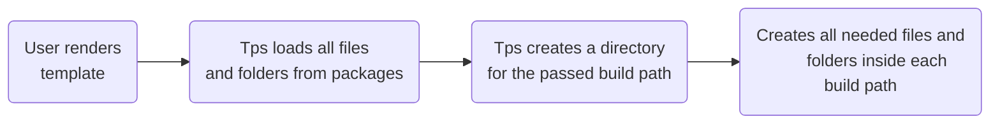

import { Example } from '@site/docs/components/example';
import Tabs from '@theme/Tabs';
import TabItem from '@theme/TabItem';
import CodeBlock from '@theme/CodeBlock';

# Templates

:::note

We will be referring to `<some-name>` in our guide to represent any directory.

:::

A tps template is a collection of folders and files that acts as a blueprint for
effortlessly recreating identical file structures in different locations. Think
of this as a google doc template but for files and folders. When rendering a tps
template, the tool scans all the files and directories within the template
folder, and renders them in a directory of your preference. Tps also allows you
to incorporate additional information during the template rendering process,
resulting in a more dynamic template.

Don't worry about all this right now! More will be discussed later on. First,
let's start with the basics.

## Where do templates live

All TPS templates need to live in a `.tps` folder. Subdirectories of the `.tps`
directory are your templates. You may have as many templates as you wish.

```text
| - .tps/
	// highlight-next-line
    | - <template...>/
```

<Example>

If I were to make a new template called <code>react-component</code> then my
folder structure would look like this:

```text
| - .tps/
	| - react-component/
```

</Example>

## Packages

Now lets break down what to put in your template folder. Inside of each
`template` you can have directories referred to as `packages`.

```text
| - .tps/
	| - <template>/
		// highlight-next-line
		| - <packages...>/
```

Now, within each package directory, you have the freedom to add an unlimited
number of files and directories. These resources will be utilized during the
template rendering process. You are free to name the packages as you wish, with
one exception. While each template can have a `default` package, it is not
mandatory to specify one.

Every time you render a template, tps will automatically utilize all the
contents _(files/directories)_ within your `default` package. For any additional
package contents that you wish to include in the rendering process, you must
explicitly specify them when rendering the template.

Dont worry more will be covered on this in our next section of this guide

<Example open>

Lets say we have a template called `node-server`. This template is responsible
for setting up a brand new webserver with all the bells and whistles included.

```text
| - .tps/
	| - node-server/
		| - default/
			// highlight-start
			| - server.js
			| - package.json
			// highlight-end
```

let's say today we had a new idea for a trash removal company called
`trash-removal`. If we wanted to generate this app with our template then it
would create a new directory called `trash-removal` and render all files inside
the templates `default` package and place them into the new `trash-removal`
directory it just created

```text
| - trash-removal/
	// highlight-start
	| - server.js
	| - package.json
	// highlight-end
```

</Example>

:::note

You can learn more about packages in our [packages guide](./packages)

:::

## Settings file

```text
| - .tps/
	| - <template>/
		// highlight-next-line
		| - settings.json
```

A template can optionally have a settings file where you can define prompts and
other configuration details. The settings file will be discussed in more detail
later in this guide.

:::note

You can learn more about the settings file in our
[settings file guide](./settings)

:::

## Dynamic files

Within each package, you can use dynamic files. Dynamic files are files that end
with a `.dot` extension. These files enable you to leverage all the features
provided by [doT](http://olado.github.io/doT/index.html) within tps.

Dynamic files provide the capability to pass data and enhance the power of
dynamic rendering. By utilizing this data, you can leverage the features of doT
to conditionally render specific sections of code or perform other dynamic
operations. This allows for more flexibility and customization in your
templates.

## Making a new template

There is nothing special about a template. Its nothing other than a directory
holding a collection of files and folders. We could create a template two ways:

1. Use our command line tool _(recommended)_
2. Create the directories and files with `mkdir/touch` or use Finder etc.

:::note

Read more about our command line docs [here](../../api/cli)

:::

<Tabs>
	<TabItem value="tps" label="tps cli" default>

Our command line tools will create the `default` folder for you.

```bash
tps new template <template-name>
```

:::note

Read more about our `new` command more [here](../../api/cli#new)

:::

  </TabItem>
  <TabItem value="bash" label="bash">

```bash
mkdir .tps/<template-name>

mkdir .tps/<template-name>/default
```

  </TabItem>
</Tabs>

## Rendering a new template

### what is rendering a template

Rendering a new template, also known as template instantiation or the template
instantiation process, refers to the action of utilizing a template as a
starting point to create a new instance. It involves rendering the files and
folders from the template folder and transferring them to the **build path(s)**.

<br />
<br />



<br />
<br />

The `build path` is the information you provide to TPS to specify the location
and details of the new template to be created. It can be thought of as the name
or identifier for the new template. When TPS receives the build path, it creates
a directory with that name and renders all the files and folders from your
template packages into this newly created directory. In essence, the build path
acts as a directive to TPS, guiding it in assembling the new template by
organizing the appropriate files and folders in the designated directory.

### Single build path

When the build path is a single word, tps utilizes it as the name for your new
instance. It then generates a fresh directory with the given name within the
current directory you are in, and proceeds to render all contents within the
newly created directory.

```text
// highlight-next-line
app
|__|
 ^ Build path & template name
```

<Example>

If we were rendering a new instance from a template and we have the build path
`app` then templates will create a new directory called `app` and render all
contents inside of it

```text title="Template structure"
| - .tps/
	// highlight-start
	| - node-server/
		| - default/
			| - server.js
			| - package.json
	// highlight-end
```

```text title="Rendered instance"
// highlight-start
| - app/
	| - server.js
	| - package.json
// highlight-end
```

</Example>

### Long build path

If you give tps a long build path, it uses it as the path to create your new
template. The last word becomes the template name, and the words before that
show which directory you want the new instance to be in. If the directory doesnt
exist, tps will create it.

```text
// highlight-next-line
some/path/app
		  |__| <- template name
|____________|
	^ Build path
```

<Example>

If we were rendering a new instance from a template and we have the build path
`code/projects/app` then templates will create a new directory called `app`
inside of `<cwd>/code/projects` and render all contents inside of it.

```text title="Template structure"
| - .tps/
	// highlight-start
	| - node-server/
		| - default/
			| - server.js
			| - package.json
	// highlight-end
```

```text title="Rendered instance"
|- code
	|- projects
		// highlight-start
		| - app/
			| - server.js
			| - package.json
		// highlight-end
```

</Example>

### Multiple build paths

You can also pass in multiple build paths at the same time. This is going to be
the same as passing in one but for each one.

<Example>

If we were rendering a new instance from a template and we have the build paths
`code/projects/app` & `code/projects/app2` then templates will create new
directories for both and render contents into both of them.

```text title="Template structure"
| - .tps/
	// highlight-start
	| - node-server/
		| - default/
			| - server.js
			| - package.json
	// highlight-end
```

```text title="Rendered instance"
|- code
	|- projects
		// highlight-start
		| - app/
			| - server.js
			| - package.json
		| - app2/
			| - server.js
			| - package.json
		// highlight-end
```

</Example>

### How to render a template

There are two ways on how to render a template. One is via our command line tool
or by our `node_module` package. We wont go deep into this topic right now but
here are some basics.

`<template-to-use>` is the name of the template you would like to use.

:::tip

Not sure what templates you have? Check out our
[list command](../../api/cli#list)

:::

`<build-paths...>` is the location/name of where you want your new rendered
template to go

<Tabs groupId="cli-node">
  <TabItem value="tps" label="tps cli" default>

```bash
# create command

tps create --use=<template-to-use> <build-paths...>

# or use command

tps <template-to-use> <build-paths...>
```

  </TabItem>
  <TabItem value="node" label="Node">

```js
const Templates = require('tps');

const tps = new Templates('<template-to-use>');
// ^ In js pass in the name to the template here

const buildPaths = ['<build-paths...>'];
// ^ In js build paths should always be an array

tps.render('<some-directory-path>', buildPaths);
// ^ In js we need to add a path to some directory so tps has a
// starting directory. tps cli tools uses this node module
// underneath the hood and uses the terminals current working
// directory as the `<some-directory-path>` path
```

  </TabItem>
</Tabs>

---

<Example title="One Build Path" open>

<Tabs groupId="cli-node">
  <TabItem value="tps" label="tps cli">

```bash
# create command

tps create --use=express-template app

# or use command

tps express-template app

```

  </TabItem>

  <TabItem value="node" label="Node">

```js showLineNumbers
const Templates = require('tps');

const tps = new Templates('express-template');

const buildPaths = ['app'];

tps.render(process.cwd(), buildPaths);
```

  </TabItem>
</Tabs>

</Example>

<Example title="Long Build Path">

<Tabs groupId="cli-node">
  <TabItem value="tps" label="tps cli">

```bash
# create command

tps create --use=express-template projects/app

# or use command

tps express-template projects/app
```

  </TabItem>

  <TabItem value="node" label="Node">

```js showLineNumbers
const Templates = require('tps');

const tps = new Templates('express-template');

const buildPaths = ['projects/app'];

tps.render(process.cwd(), buildPaths);
```

  </TabItem>
</Tabs>

</Example>

<Example title="multiple build path">

<Tabs groupId="cli-node">
  <TabItem value="tps" label="tps cli">

```bash
# create command

tps create --use=express-template app project/app app2

# or use command

tps express-template app project/app app2
```

  </TabItem>

  <TabItem value="node" label="Node">

```js showLineNumbers
const Templates = require('tps');

const tps = new Templates('express-template');

const buildPaths = ['app', 'projects/app', 'app2'];

tps.render(process.cwd(), buildPaths);
```

  </TabItem>
</Tabs>

</Example>
