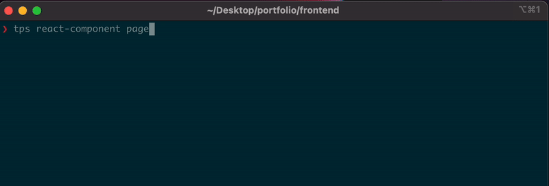

# Templates

Supercharge Your Development with Templates: Code Faster, Build Better!

---

<p>
<a href="https://www.npmjs.com/package/templates-mo"></a>
<a href="CONTRIBUTING.md#pull-requests"></a>
<a href="https://github.com/marcellino-ornelas/templates/actions/workflows/tests.yml"></a>
<a href="https://github.com/marcellino-ornelas/templates/actions/workflows/publish-gh-pages.yml"></a>
</p>

Templates is a powerful filesystem generator that aims to simplify the process of getting started with and maintaining code applications. Its purpose is to provide developers with a friendly tool that streamlines their common day-to-day workflows. The versatility of templates extends to various scenarios, such as creating web applications in any programming language or generating new sections within a project, such as web controllers with unit tests or React components integrated with Redux and TypeScript.



**[Check out our docs](https://marcellino-ornelas.github.io/templates/)**

> This project was inspired from [create-components-react](https://github.com/marcellino-ornelas/create-components-react)

## Installation

```
npm install -g templates-mo
```

## Development

### Accessing dev cli

When making changes to templates, to test changes using tps cli use the `./.bin/cli` file.

```bash
./.bin/cli react-component App
```

### Testing

Run all unit tests

> !WARNING: We dont recommend running all tests. This creates a lot of files and folders. Push your changes up to your branch and let github actions handle running these tests.

```bash
> npx jest
```

Run single unit tests

```bash
> npx jest path/to/file
```

### Debug

you can debug tests or cli commands by using the `DEBUG` env variable. This will force templates to print out valuable information about the build process and the steps it took to get there.

```bash
DEBUG=tps npx jest path/to/file
```

or cli

```bash
DEBUG=tps ./.bin/cli react-component App
```

<!-- (Template Processing System) -->
